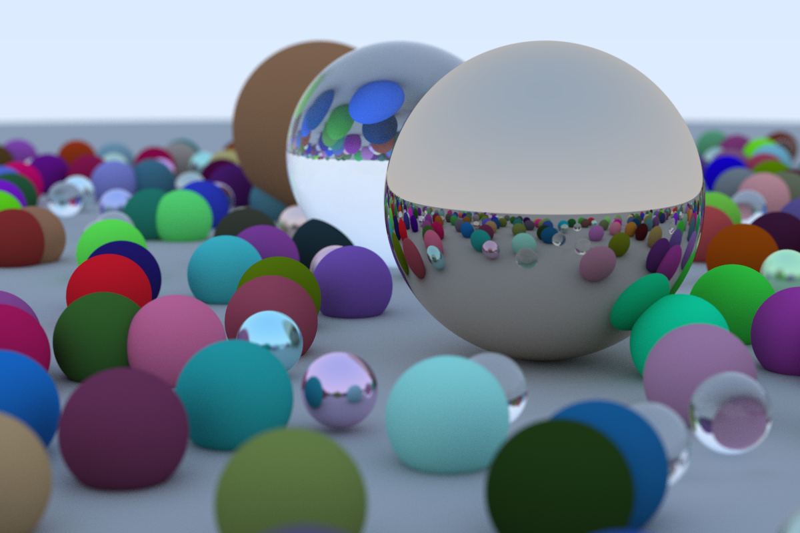

# Rukako

Rukako is a WIP GPU renderer in Rust.

## Run

Currently, it only renders the scene appeared in [Ray Tracing in One Weekend](https://raytracing.github.io/books/RayTracingInOneWeekend.html).

```bash
$ cargo run
```

and open `out.png`.

Output should be like

